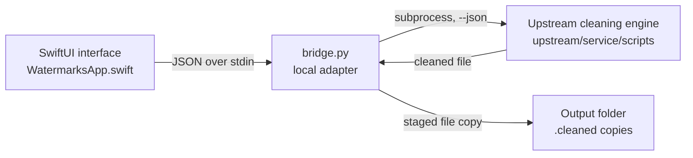

# Architecture

Watermarks Cleaner is a native SwiftUI macOS app that wraps the deterministic, offline cleaning engine from [guillaumemeyer/watermarks-remover](https://github.com/guillaumemeyer/watermarks-remover). The engine runs as a child process; the app never reaches the network.

## High-level overview

| Layer | Location | Role |
| --- | --- | --- |
| UI | `app/WatermarksApp.swift` | Files/Text modes, batch orchestration, reports |
| Adapter | `app/bridge.py` | Converts UI actions into engine invocations, owns output safety |
| Engine | `upstream/service/scripts/` | Unmodified upstream cleaners (`clean_file.py`, `inspect_file.py`, `text_unicode.py`) |
| Build | `scripts/build.sh` | Compiles the Swift binary, bundles the engine, signs ad-hoc |
| Tests | `tests/test_app.py` | Integration tests against the adapter and engine |

## Process model

The SwiftUI app finds the first available `python3` on the system (`/opt/homebrew/bin`, `/usr/local/bin`, `/usr/bin`) and launches `bridge.py` once per request as a detached child process. All communication is **JSON over stdio**: the app writes one request object to stdin and reads one response object from stdout. stderr goes to the null device so unstructured engine output can never corrupt the response stream.

This isolation is deliberate:

- The engine is large, unmodified Python; a subprocess keeps its imports, warnings, and crashes out of the app process.
- A per-request 180-second timeout prevents hung cleaners from freezing the UI.
- Each file operation is stateless — nothing is held in memory between files, so a 100-file batch cannot accumulate resources.

## Request/response protocol

The app sends `{"action": "...", ...}` and receives `{"ok": bool, "summary": string, ...}`.

| Action | Request fields | Adapter behavior | Response extras |
| --- | --- | --- | --- |
| `inspect` | `path` | Runs `inspect_file.py --json` | `report` (engine findings) |
| `clean` | `path`, `outputDirectory`, `preserveMetadata` | Runs `clean_file.py -o <staged> [--keep-non-ai-metadata]` into a temp dir, then exports the result | `output` (final path), `warning` |
| `text` | `text` | Imports `text_unicode.clean_text` in-process (no file I/O) | `text` (cleaned), `report` (stats) |

## Cleaning flow

1. **Stage** — `clean_file.py` writes its output into a per-request `TemporaryDirectory`, never next to the original.
2. **Reserve** — `export_copy()` opens the destination with `O_CREAT | O_EXCL`, so concurrent runs can never overwrite an existing export; the first free `name.cleaned.ext`, `name.cleaned-2.ext`, … wins.
3. **Copy & report** — the staged file is streamed into the reserved name and the engine's JSON report is attached (`output`, `still_has_c2pa`, `still_has_ai_metadata`, per-file `actions`).
4. **Warn** — residual marks, degraded best-effort PDFs, or engine warnings flip the UI row to a "review warnings" state.

Originals are never opened for writing. A `Stop` request breaks the batch loop after the current file; the adapter's subprocess timeout bounds the worst case.

## Engine classification

The upstream engine classifies each file as `text`, `image`, `container`, `av` (audio/video), or `unknown`:

- **text** — hidden Unicode marks, zero-width characters, unusual spaces, homoglyphs
- **image** — C2PA/EXIF/XMP and AI-provenance segments in PNG/JPEG/WebP/AVIF/HEIC/SVG
- **container** — document metadata inside PDF, Office, EPUB, markdown, HTML
- **av** — AI metadata in audio/video containers
- **unknown** — refused; never mutated

The `preserveMetadata` toggle maps to the engine's `--keep-non-ai-metadata` flag: enabled, only AI/C2PA segments are dropped; disabled, broader metadata removal is requested.

## Build pipeline

`scripts/build.sh`:

1. Assembles `dist/Watermarks Cleaner.app/Contents`.
2. Copies `bridge.py` and the vendored engine into `Contents/Resources`.
3. Renders the app icon into an `.icns` set with `sips`/`iconutil`.
4. Compiles `WatermarksApp.swift` with `swiftc` (Swift 5, `-O`).
5. Ad-hoc codesigns the bundle (`codesign --force --sign -`).

The output is locally signed and intended for the build machine, not notarized distribution.

## Vendored engine

`upstream/` contains a **pinned snapshot** of the upstream repository, reduced to exactly what the app uses:

- `upstream/service/scripts/` — unmodified cleaning engine
- `upstream/tests/fixtures/` — samples used by the integration tests
- `upstream/LICENSE` — MIT license, also shipped inside the app bundle

The pinned revision is recorded in the README. Upstream hooks, skills, Docker services, and optional model/research backends are deliberately not vendored and never launched. See CONTRIBUTING.md for the update procedure.

## Testing

`tests/test_app.py` (stdlib `unittest`) drives `bridge.py` directly:

- Text cleaning preserves Bengali script and emoji while removing zero-width spaces.
- Originals and existing exports survive repeated clean runs (`O_EXCL` naming).
- A synthetic PNG with an "OpenAI DALL-E" tEXt chunk loses the marker while pixel data stays byte-identical.
- Unknown binaries are refused without producing an export.
- Office documents round-trip through the container cleaner as valid zip archives.

## Security & privacy

- No network code anywhere in the app path; files never leave the Mac.
- Inputs are validated at the boundary: file size limits (8 MB text paste, 256 MB engine limit), path resolution (`resolve(strict=True)`), file-vs-directory checks.
- Export filenames are derived from the source stem only and reserved atomically.
- The engine's `server.py` and model-backend scripts are present but unreferenced; the adapter calls only the file/text entry points.
