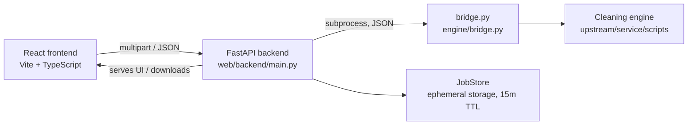

# Architecture

SansMeta is an open-source, privacy-first service that wraps a deterministic, offline cleaning engine derived from [guillaumemeyer/watermarks-remover](https://github.com/guillaumemeyer/watermarks-remover). The engine runs as an isolated child process; file operations are ephemeral and strictly sandboxed.

## High-level overview

| Layer | Location | Role |
| --- | --- | --- |
| Frontend | `web/frontend/src/` | Files/Text modes, batch workspace, progress, reports. Landing and branding |
| API | `web/backend/main.py` | `/api/inspect`, `/api/clean` (async job), `/api/jobs/{id}/status`, `/api/jobs/{id}/zip`, `/api/text`, `/api/health` |
| Jobs | `web/backend/jobs.py` | In-memory job store: per-job upload/export dirs, cancellation events, response-completion cleanup, 15-minute fallback expiry |
| Pipeline | `web/backend/pipeline.py` | Batch loops calling `inspect_file.py` / `clean_file.py` |
| Bridge | `engine/bridge.py` | Stdio adapter converting actions into engine invocations, owning output safety |
| Engine | `upstream/service/scripts/` | Cleaners (`clean_file.py`, `inspect_file.py`, `text_unicode.py`) |
| Tests | `tests/test_app.py` | Integration tests against the engine bridge |

## Process model

The backend launches `engine/bridge.py` once per file/task as an isolated child process. All communication is **JSON over stdio**: the caller writes one request object to stdin and reads one response object from stdout. stderr is captured separately so engine logs cannot corrupt the structured response stream.

This isolation ensures:
- The engine is isolated in a subprocess to keep imports, memory overhead, and crashes out of the web API server process.
- A per-request timeout bounds long operations.
- Each file operation is stateless — nothing is held in memory between files.

## Request/response protocol

The caller sends `{"action": "...", ...}` and receives `{"ok": bool, "summary": string, ...}`.

| Action | Request fields | Adapter behavior | Response extras |
| --- | --- | --- | --- |
| `inspect` | `path` | Runs `inspect_file.py --json` | `report` (engine findings) |
| `clean` | `path`, `outputDirectory`, `preserveMetadata` | Runs `clean_file.py -o <staged> [--keep-non-ai-metadata]` into a temp dir, then exports the result | `output` (final path), `warning` |
| `text` | `text` | Imports `text_unicode.clean_text` in-process (no file I/O) | `text` (cleaned), `report` (stats) |

## Cleaning flow

1. **Stage** — `clean_file.py` writes its output into a per-request `TemporaryDirectory`, never modifying the original.
2. **Reserve** — `export_copy()` opens the destination with `O_CREAT | O_EXCL`, so concurrent runs can never overwrite an existing export; the first free `name.cleaned.ext`, `name.cleaned-2.ext`, … wins.
3. **Copy & report** — the staged file is streamed into the reserved name and the engine's JSON report is attached (`output`, `still_has_c2pa`, `still_has_ai_metadata`, per-file `actions`).
4. **Warn** — residual marks, degraded best-effort PDFs, or engine warnings flag the file for review.

## Engine classification

The engine classifies each file as `text`, `image`, `container`, `av` (audio/video), or `unknown`:

- **text** — hidden Unicode marks, zero-width characters, unusual spaces, homoglyphs
- **image** — C2PA/EXIF/XMP and AI-provenance segments in PNG/JPEG/WebP/AVIF/HEIC/SVG
- **container** — document metadata inside PDF, Office, EPUB, markdown, HTML
- **av** — AI metadata in audio/video containers
- **unknown** — refused; never mutated

## Native Desktop App

The native macOS application is maintained as a companion application in a private repository (`sansmeta-mac`) using the same core engine for 100% offline desktop processing.

## Testing

- `tests/test_app.py` (stdlib `unittest`) validates `engine/bridge.py` and upstream tools directly.
- `web/backend/tests/test_api.py` (pytest, FastAPI TestClient) covers API endpoints, file uploads, zip exports, cleanup lifecycles, and CORS.
- `web/frontend/` is verified with `tsc --noEmit && vite build`.
